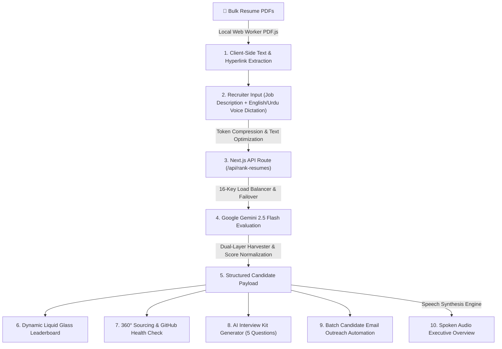

<div align="center">

# ♾️ Talento
### *Intelligent Voice-First HR Applicant Tracking System (ATS) & Sourcing Copilot*

[](https://nextjs.org/)
[](https://www.typescriptlang.org/)
[](https://ai.google.dev/)
[](https://tailwindcss.com/)
[](LICENSE)

</div>

---

## 📖 Overview

**Talento** is an enterprise-grade, voice-first Applicant Tracking System (ATS) co-pilot built to streamline high-volume talent acquisition. Instead of manually reviewing hundreds of static PDF resumes, recruiters can bulk parse candidate CVs in-browser, define custom criteria, and interact with an AI co-pilot using natural voice commands in **English** or **Urdu (اردو)**.

Talento delivers instant candidate rankings, customized 5-question interview kits, automated batch email outreach, and a 360-degree candidate sourcing engine complete with GitHub codebase health diagnostics.

---

## ✨ Key Features

### 1. ⚡ Client-Side Bulk PDF Ingestion
* **In-Browser Web Worker Parsing**: Parses dozens of candidate PDF resumes simultaneously in browser RAM using `pdfjs-dist` Web Workers.
* **Embedded Hyperlink Harvester**: Extracts hidden PDF annotation links (LinkedIn, GitHub, Portfolios) embedded behind names, icons, or text.
* **100% Data Privacy**: CV text is processed locally before sending optimized payloads to the API — zero server PDF file uploads.

### 2. 🎙️ Multi-Lingual Voice Recruiter Assistant (STT & TTS)
* **Speech-to-Text Dictation**: Hands-free voice commands using SpeechRecognition with a continuous 3.5s silence buffer (prevents premature cutoffs).
* **Text-to-Speech Summaries**: Spoken executive overviews and candidate match summaries using HD natural speech voices.
* **Native Urdu Support (`ur-PK`)**: Dictate commands in Urdu (e.g. *"Lesser experience wale candidates top pe rakho"*) and receive spoken summaries in clean native Urdu script.

### 3. 🛡️ Multi-Key API Load Balancing & Failover (16 Keys)
* **High-Throughput Pool**: Randomly distributes requests across 16 active Gemini API keys.
* **Automatic Failover**: Instantly rotates to backup keys upon rate limits or quota exhaustion to guarantee zero system downtime.

### 4. 📝 AI-Automated Interview Kit Generator
* **Tailored Technical & Behavioral Questions**: Generates 5 customized interview questions per candidate targeting work history, tech stack transitions (e.g. *C# to Node.js*), or resume gaps.
* **1-Click Copy & Read Aloud**: Built-in clipboard copying and audio readout for every interview question.

### 5. ✉️ Batch Action & Email Outreach Automation
* **Leaderboard Selection**: Shortlist candidates using table checkboxes and a floating Batch Action Bar.
* **Personalized Outreach Templates**: Generate tailored invitations for *First-Round Interviews*, *Technical Screenings*, or *Talent Pool Updates*.
* **One-Click Dispatch (`mailto:`)**: Deep-links directly to native mail clients (Outlook, Gmail, Apple Mail) pre-populated with candidate recipient, subject, and body text.

### 6. 🌐 360° Sourcing & GitHub Repository Health Check
* **Automated Profile Detection**: Extracts GitHub, LinkedIn, Kaggle, and personal portfolio links.
* **Codebase Health Diagnostics**: Evaluates project quality score (0-100), commit activity consistency (*"High Activity - Active Contributor"*), top languages used, and validates resume claims against public code repositories.

---

## 🏗️ System Architecture & Data Flow



---

## 🛠️ Tech Stack

| Domain | Technologies Used |
| :--- | :--- |
| **Framework** | [Next.js 16 (App Router)](https://nextjs.org/), [React 19](https://react.dev/), [TypeScript](https://www.typescriptlang.org/) |
| **Styling** | Vanilla CSS, [Tailwind CSS v4](https://tailwindcss.com/), Google Fonts **Geist** |
| **UI Aesthetics** | Liquid Glass Aesthetic (backdrop blur, inset luminosity shadows, mask-composite gradient borders) |
| **AI Model** | Google Gemini 2.5 Flash via `@google/genai` SDK |
| **PDF Processing** | `pdfjs-dist` (Web Workers & Annotation Link Parser) |
| **Voice Engine** | Web Speech API (`SpeechRecognition` & `SpeechSynthesis`) |
| **Icons** | [Lucide React](https://lucide.dev/) |

---

## 🚀 Getting Started

### Prerequisites
* **Node.js**: `v18.0.0` or higher
* **npm** or **yarn**

### Local Installation

1. **Clone the Repository**:
   ```bash
   git clone https://github.com/ammar-tahir012/talento.git
   cd talento
   ```

2. **Install Dependencies**:
   ```bash
   npm install
   ```

3. **Configure Environment Variables**:
   Create a `.env.local` file in the root directory:
   ```env
   GEMINI_API_KEY=your_gemini_api_key_here
   GEMINI_API_KEY_2=your_second_gemini_api_key_here
   GEMINI_API_KEY_3=your_third_gemini_api_key_here
   ```

4. **Run Development Server**:
   ```bash
   npm run dev
   ```
   Open `http://localhost:3000` in your browser.

5. **Build for Production**:
   ```bash
   npm run build
   npm run start
   ```

---

## 👨‍💻 Developer & Creator

**Ammar Tahir**  
*Full-Stack AI Developer & Lead Creator of Talento*  
📧 **Email**: [ammartahir444@gmail.com](mailto:ammartahir444@gmail.com)  
🐙 **GitHub**: [github.com/ammar-tahir012](https://github.com/ammar-tahir012)

---

## 📄 License
This project is licensed under the [MIT License](LICENSE).
